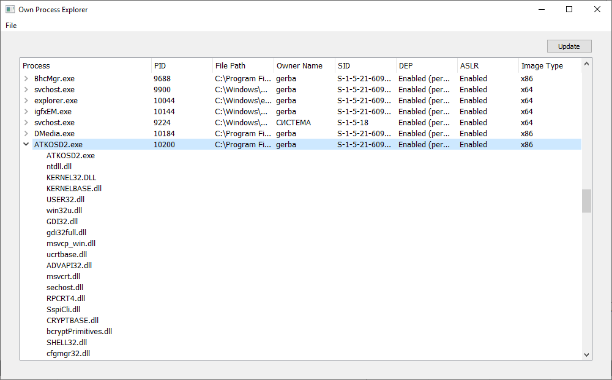
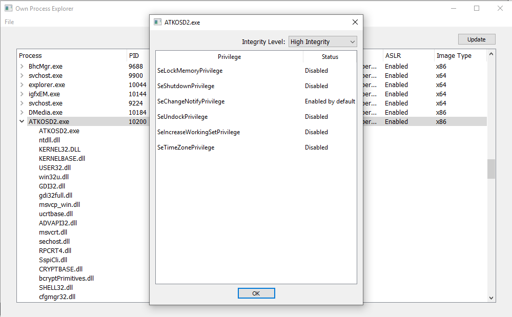
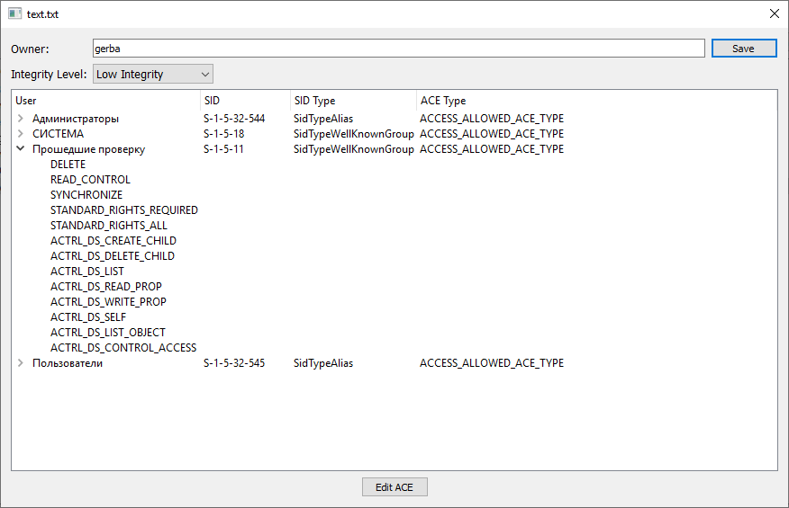
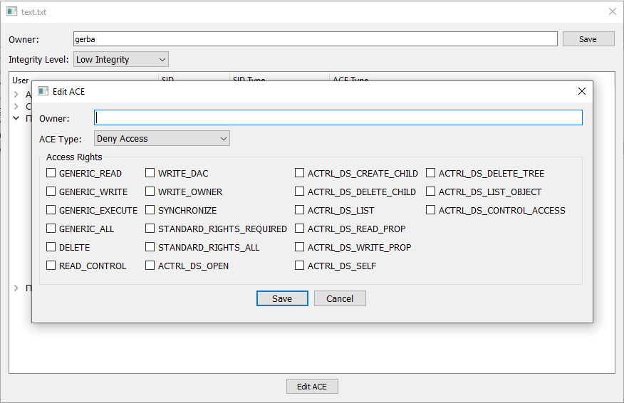

# OwnWindowsProcessExplorer
## Description:
This is a simple process explorer for Windows, written only with C++ and Qt and using Windows API.
It has basic process explorer features:
1. Showing name of process, it's type, DEP and ASLR usage and DLLs used by the process.
2. Allows to change integrity level
3. Allows to change privileges

Also it can be used to show and change files/folders information:
1. ACL of file or folder
2. File/folder owner
3. Integrity level

# Screenshots:

---

## Description in Russian:
Peter the Great St.Petersburg Polytechnic University, 3rd grade.

Lab 4.

Цель работы
Исследование архитектуры подсистемы безопасности и механизмов контроля доступа ОС Windows
Формулировка задания
Необходимо разработать программу с графическим интерфейсом, которая осуществляет вывод и изменение различных прав субъектов по отношению к различным объектам ОС Windows, а также другой информации о процессах, функционирующих в ОС. Язык программирования – любой. При разработке программы стоит ориентироваться на подходы, заложенные в программах со схожим функционалом, таких как ProcessExplorer и ProcessHacker.
В ходе выполнения лабораторной работы необходимо выполнить следующие действия:
1.	Изучить механизмы контроля доступа в ОС Windows (списки контроля доступа, политики целостности, привилегии субъектов, уровни целостности, роли, права владельца и другие).
2.	Разработать программу с графическим интерфейсом, собирающую информацию об объектах и субъектах ОС Windows.
3.	Разработанная программа должна выводить список процессов, функционирующих в операционной системе и следующую  информацию о каждом из процессов:
	имя процесса;
	идентификатор процесса (PID);
	путь до исполняемого файла;
	имя и идентификатор родительского процесса;
	имя пользователя владельца процесса, SID;
	тип процесса (32-bit / 64-bit);
	использование DEP, ASLR;
	список используемых динамических библиотек (DLL).
4.	Разработанная программа должна выводить и изменять следующую информацию о безопасности процесса:
	уровень целостности (integrity level);
	привилегии (privileges).
5.	Разработанная программа должна выводить и изменять следующую информацию о любом заданном объекте файловой системы:
	список контроля доступа (ACL); 
   владелец файла;
	уровень целостности.
